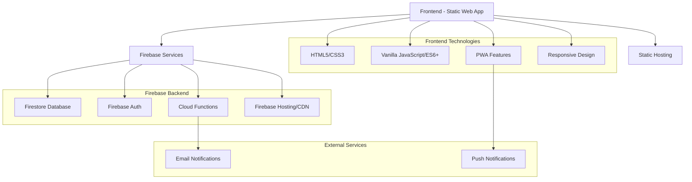
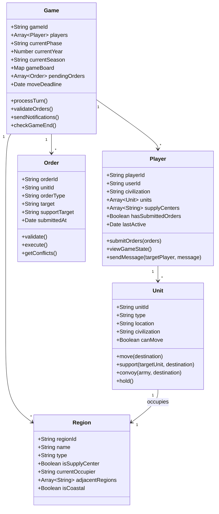
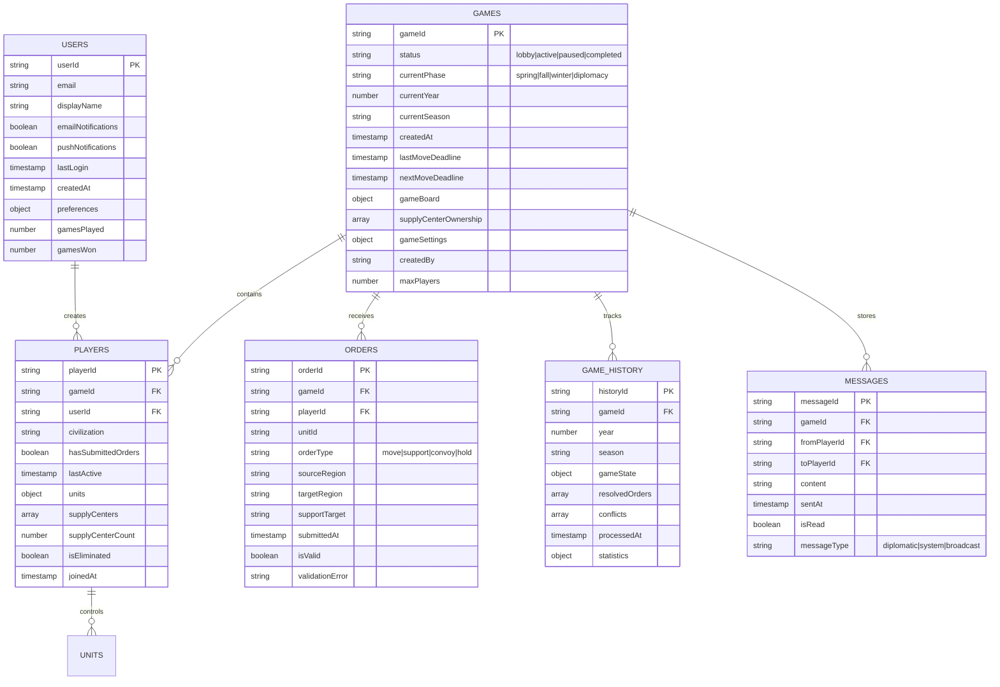
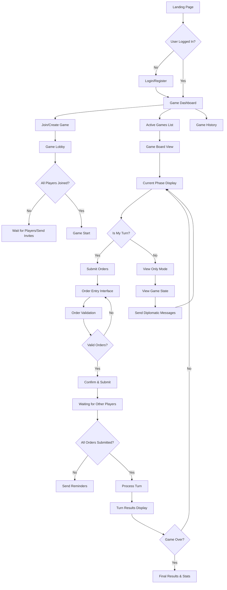

# Cradle of Civilization - Architectural Plan

## Overview

"Cradle of Civilization" is a mobile-friendly web version of the classic Diplomacy board game, themed around the ancient Middle East. This document provides a comprehensive architectural plan for building the game with a focus on simplicity, small group play (2-7 players), and asynchronous turn-based gameplay.

## Table of Contents
1. [Game Design & Theming](#game-design--theming)
2. [Technical Architecture](#technical-architecture)
3. [Core System Components](#core-system-components)
4. [Mobile-First User Experience](#mobile-first-user-experience)
5. [Implementation Roadmap](#implementation-roadmap)
6. [Technical Considerations](#technical-considerations)

## 1. Game Design & Theming

### Ancient Middle East Powers (7 Civilizations)
- **Babylon** (Mesopotamia region) - The great empire of Hammurabi and Nebuchadnezzar
- **Assyria** (Northern Mesopotamia) - Military powerhouse of the ancient world
- **Egypt** (Nile Valley) - The kingdom of pharaohs and pyramids
- **Persia** (Iranian Plateau) - The vast empire of Cyrus and Darius
- **Phoenicia** (Eastern Mediterranean coast) - Masters of trade and navigation
- **Hittites** (Anatolia) - Iron Age innovators and warriors
- **Elam** (Western Iran) - Ancient rival of Mesopotamian powers

### Map Design
- **42 regions** covering the ancient Middle East (simplified from 75 in classic Diplomacy)
- **22 supply centers** strategically placed (reduced from 34 in classic)
- **Victory condition**: Control 12 supply centers (majority rule)

#### Key Geographical Features
- **Rivers**: Tigris, Euphrates, Nile - crucial for movement and supply
- **Seas**: Mediterranean Sea, Persian Gulf, Red Sea
- **Strategic regions**: Mesopotamian plains, Anatolian highlands, Nile Delta
- **Mountain passes**: Zagros Mountains, Taurus Mountains for defensive positions

### Core Diplomacy Rules Adaptation
- **Simultaneous movement phases** - all orders resolved at once
- **Support and convoy mechanics** - units can assist each other
- **Diplomatic negotiation** between turns via in-game messaging
- **Seasonal structure**: Spring/Fall movement, Winter adjustments
- **Simplified communication** - no restrictions for casual friendly play
- **Build/disband rules** adapted for smaller map scale

## 2. Technical Architecture

### Technology Stack Overview



### Hosting Strategy
- **Frontend**: Static hosting (Netlify/GitHub Pages) with PWA capabilities
- **Backend**: Firebase services for authentication, database, and cloud functions
- **CDN**: Firebase Hosting or Netlify for global content delivery
- **Email**: SendGrid or Firebase Extensions for notifications

### Project Structure
```
cradle-of-civilization/
├── public/
│   ├── index.html                 # Main application entry point
│   ├── manifest.json              # PWA manifest
│   ├── service-worker.js          # Offline capabilities
│   └── icons/                     # App icons for various devices
├── src/
│   ├── js/
│   │   ├── core/
│   │   │   ├── game-engine.js     # Core game logic and rules
│   │   │   ├── rule-validator.js  # Order validation system
│   │   │   └── map-data.js        # Ancient Middle East map data
│   │   ├── ui/
│   │   │   ├── game-board.js      # Interactive map rendering
│   │   │   ├── order-input.js     # Mobile-friendly order entry
│   │   │   ├── mobile-controls.js # Touch interactions
│   │   │   └── notifications.js   # In-app notification system
│   │   ├── services/
│   │   │   ├── firebase-service.js # Firebase integration
│   │   │   ├── game-service.js     # Game state management
│   │   │   └── notification-service.js # Email/push notifications
│   │   └── utils/
│   │       ├── constants.js        # Game constants and enums
│   │       └── helpers.js          # Utility functions
│   ├── css/
│   │   ├── main.css               # Core styles
│   │   ├── mobile.css             # Mobile-specific styles
│   │   └── themes.css             # Ancient Middle East theming
│   └── assets/
│       ├── images/                # Civilization icons, map assets
│       ├── sounds/                # Audio feedback (optional)
│       └── maps/                  # Map SVG files and regions
├── functions/
│   ├── index.js                   # Cloud Functions entry point
│   ├── game-logic.js              # Server-side game processing
│   ├── email-notifications.js     # Email service integration
│   └── turn-processor.js          # Automated turn resolution
├── firebase.json                  # Firebase configuration
├── package.json                   # Dependencies and scripts
└── README.md                      # Setup and deployment instructions
```

## 3. Core System Components

### Game State Management



### Database Schema (Firestore)



### Key Data Structures

#### Game State Object
```javascript
{
  gameId: "string",
  status: "lobby|active|paused|completed",
  currentPhase: "spring|fall|winter|diplomacy",
  currentYear: number,
  currentSeason: "spring|fall",
  players: [
    {
      playerId: "string",
      civilization: "babylon|assyria|egypt|persia|phoenicia|hittites|elam",
      supplyCenters: ["region1", "region2"],
      units: [
        {
          unitId: "string",
          type: "army|fleet",
          location: "regionId",
          canMove: boolean
        }
      ],
      hasSubmittedOrders: boolean,
      isEliminated: boolean
    }
  ],
  gameBoard: {
    regions: {
      "regionId": {
        name: "string",
        type: "land|sea|coast",
        isSupplyCenter: boolean,
        occupiedBy: "civilizationId|null",
        adjacentRegions: ["regionId1", "regionId2"]
      }
    }
  },
  moveDeadline: timestamp,
  gameSettings: {
    turnLengthHours: 48,
    allowPublicMessages: true,
    autoProcess: true
  }
}
```

## 4. Mobile-First User Experience

### User Flow Architecture



### Mobile Interface Components

#### Game Board Interface
- **Zoomable map**: Pinch-to-zoom and pan gestures for detailed region viewing
- **Touch-friendly regions**: Large touch targets (minimum 44x44px) for region selection
- **Unit representation**: Clear visual distinction between armies and fleets
- **Supply center indicators**: Prominent visual markers for victory conditions
- **Current phase indicator**: Always visible turn status and deadline countdown

#### Order Entry System
- **Drag-and-drop**: Intuitive unit movement by dragging units to destinations
- **Context menus**: Long-press on units to reveal order options (move, support, hold)
- **Visual feedback**: Animated order previews before confirmation
- **Order summary**: Clear list of all submitted orders with edit capability
- **Validation messages**: Immediate feedback on invalid orders

#### Responsive Design Breakpoints
- **Mobile Portrait**: 320px - 480px (primary target)
- **Mobile Landscape**: 481px - 768px
- **Tablet**: 769px - 1024px
- **Desktop**: 1025px+ (secondary support)

### Progressive Web App Features
- **Offline capability**: View game state and prepare orders without internet
- **Push notifications**: Turn reminders and game updates
- **App-like experience**: Full-screen mode, splash screen, app icons
- **Background sync**: Submit orders when connection restored

## 5. Implementation Roadmap

### Phase 1: Core Foundation (Weeks 1-3)

#### Week 1: Project Setup
- [ ] Initialize project structure and development environment
- [ ] Set up Firebase project with Authentication and Firestore
- [ ] Create basic HTML/CSS framework with responsive design
- [ ] Implement user registration and login system
- [ ] Set up development workflow (version control, deployment pipeline)

#### Week 2: Map and Data
- [ ] Design and create ancient Middle East map SVG
- [ ] Define region data structure and adjacency rules
- [ ] Implement basic map rendering and interaction
- [ ] Create civilization data (names, colors, starting positions)
- [ ] Set up basic routing and navigation

#### Week 3: Authentication and User Management
- [ ] Complete Firebase Authentication integration
- [ ] Build user profile management
- [ ] Implement game invitation system
- [ ] Create basic dashboard for active games
- [ ] Add email notification setup

### Phase 2: Game Engine (Weeks 4-6)

#### Week 4: Core Game Logic
- [ ] Implement Diplomacy movement rules
- [ ] Build order validation system
- [ ] Create support and convoy mechanics
- [ ] Add basic unit placement and movement
- [ ] Implement supply center control logic

#### Week 5: Turn Processing
- [ ] Build simultaneous order resolution system
- [ ] Implement conflict resolution algorithms
- [ ] Add retreat and disband mechanics
- [ ] Create build/adjustment phase logic
- [ ] Add game state persistence

#### Week 6: Game Flow Management
- [ ] Implement seasonal progression (Spring/Fall/Winter)
- [ ] Add victory condition checking
- [ ] Create game history tracking
- [ ] Build automated turn processing
- [ ] Add game pause/resume functionality

### Phase 3: User Interface (Weeks 7-9)

#### Week 7: Interactive Game Board
- [ ] Build touch-friendly map interface
- [ ] Implement zoom and pan functionality
- [ ] Create unit drag-and-drop system
- [ ] Add visual order preview system
- [ ] Implement region highlighting and selection

#### Week 8: Order Management
- [ ] Design mobile-optimized order entry
- [ ] Build order validation UI
- [ ] Create order summary and editing interface
- [ ] Add visual feedback for invalid orders
- [ ] Implement order submission workflow

#### Week 9: Game Dashboard and Navigation
- [ ] Build responsive game dashboard
- [ ] Create game lobby and player management
- [ ] Add game settings and configuration
- [ ] Implement player status indicators
- [ ] Add help system and tutorial

### Phase 4: Multiplayer & Communication (Weeks 10-12)

#### Week 10: Asynchronous Gameplay
- [ ] Implement turn deadline management
- [ ] Build email notification system via Cloud Functions
- [ ] Add automatic turn processing
- [ ] Create player reminder system
- [ ] Implement game pause for inactive players

#### Week 11: Communication System
- [ ] Build in-game messaging system
- [ ] Add diplomatic communication features
- [ ] Implement notification preferences
- [ ] Create game activity feed
- [ ] Add player status tracking

#### Week 12: Advanced Features
- [ ] Implement game spectator mode
- [ ] Add game replay functionality
- [ ] Create player statistics tracking
- [ ] Build game archive system
- [ ] Add export/share game results

### Phase 5: Polish & Deployment (Weeks 13-14)

#### Week 13: Testing and Optimization
- [ ] Comprehensive testing across devices
- [ ] Performance optimization for mobile
- [ ] User experience testing with target audience
- [ ] Bug fixes and edge case handling
- [ ] Security review and penetration testing

#### Week 14: Launch Preparation
- [ ] Create user documentation and help system
- [ ] Set up production hosting and monitoring
- [ ] Implement analytics and error tracking
- [ ] Create deployment pipeline
- [ ] Prepare launch materials and marketing

## 6. Technical Considerations

### Performance Optimizations

#### Frontend Performance
- **Lazy loading**: Load map regions and game assets on demand
- **Image optimization**: Use WebP format with fallbacks, appropriate sizing
- **Code splitting**: Separate game engine from UI components
- **Caching strategy**: Service worker for offline game state access
- **Bundle optimization**: Tree shaking and minification for production

#### Database Performance
- **Efficient queries**: Use Firestore compound indices for complex queries
- **Real-time updates**: Subscribe only to relevant game data changes
- **Pagination**: Limit game history and message retrieval
- **Data denormalization**: Store computed values to reduce query complexity
- **Offline support**: Cache critical game data for offline viewing

### Security Measures

#### Authentication & Authorization
- **Firebase Security Rules**: Strict access control for game data
- **User verification**: Email verification for account creation
- **Session management**: Secure token handling and rotation
- **Rate limiting**: Prevent abuse of game actions and messaging
- **Input sanitization**: Validate all user inputs on client and server

#### Game Security
- **Server-side validation**: All game logic validated on Cloud Functions
- **Anti-cheating measures**: Encrypt sensitive game state data
- **Audit trail**: Log all player actions for dispute resolution
- **Game integrity**: Checksums for critical game state changes
- **Privacy protection**: Secure handling of player communications

### Scalability Architecture

#### Technical Scalability
- **Stateless design**: All state stored in Firebase, enabling horizontal scaling
- **Microservices approach**: Separate Cloud Functions for different game phases
- **CDN distribution**: Static assets served globally via Firebase Hosting
- **Database sharding**: Partition large datasets by game or time period
- **Auto-scaling**: Firebase handles infrastructure scaling automatically

#### Feature Scalability
- **Modular architecture**: Easy addition of new civilizations or map variants
- **Plugin system**: Extensible rules engine for game modifications
- **Theme system**: Support for different historical periods
- **Tournament system**: Framework for competitive play (future enhancement)
- **AI opponents**: Architecture ready for computer player integration

### Monitoring and Analytics

#### Application Monitoring
- **Error tracking**: Comprehensive error reporting and alerting
- **Performance monitoring**: Track load times and user interactions
- **User analytics**: Understand player behavior and engagement
- **Game analytics**: Track game completion rates and popular strategies
- **Infrastructure monitoring**: Monitor Firebase usage and costs

#### Business Intelligence
- **Player retention**: Track user engagement over time
- **Game balance**: Analyze civilization win rates and balance issues
- **Feature usage**: Understand which features are most popular
- **Performance metrics**: Monitor technical performance indicators
- **Cost optimization**: Track and optimize cloud service usage

## Conclusion

This architectural plan provides a comprehensive foundation for building "Cradle of Civilization" as a mobile-friendly, asynchronous Diplomacy game. The design emphasizes simplicity for small groups of friends while maintaining the strategic depth that makes Diplomacy engaging.

### Key Success Factors
1. **Mobile-first design** ensuring excellent user experience on smartphones
2. **Asynchronous gameplay** allowing busy adults to play over days/weeks
3. **Simple deployment** using static hosting and Firebase for minimal maintenance
4. **Scalable architecture** ready for future enhancements and growth
5. **Ancient theme** providing fresh context while preserving classic gameplay

### Next Steps
1. **Environment setup**: Configure development tools and Firebase project
2. **Technical validation**: Build proof-of-concept for core game mechanics
3. **User testing**: Validate mobile interface design with target users
4. **Iterative development**: Follow the phased implementation roadmap
5. **Community building**: Engage early users for feedback and testing

The architecture balances technical sophistication with implementation simplicity, ensuring the project can be successfully completed while providing a solid foundation for future enhancements.